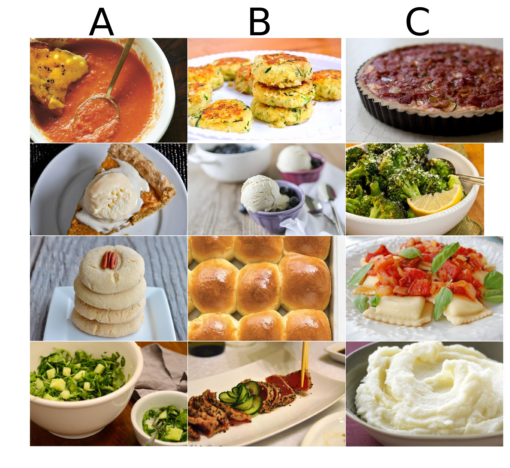

# Siamese Neural Network

The goal of this task was to make decisions on food similarity based on images and human judgments. The dataset consists of 10000 dish images, a sample of which is shown below.

Together with the image dataset, there is a set of triplets (A, B, C) provided, representing the human annotations. The human annotator judged the taste of dish A as more similar to the taste of dish B than the taste of dish C. A sample of such triplets is shown below.

  

The task is to train a neural network to predict the similarity of two dishes based on the previously unseen image triplets.

## Solution

The solution is based on the Siamese neural network architecture, inspired by the approaches in [Abbas, Moser (2021)](https://arxiv.org/abs/2106.07015) and [Wang et al. (2014)](https://openaccess.thecvf.com/content_cvpr_2014/papers/Wang_Learning_Fine-grained_Image_2014_CVPR_paper.pdf). The network consists of three identical convolutional neural networks, each of which takes one of the images in the triplet as an input. These three neural networks serve as feature extractors and are based on the pre-trained [ResNet-18](https://pytorch.org/vision/master/models/generated/torchvision.models.resnet18.html) model with a modified final layer with 1024 output neurons.

For the training, we split the dataset into the train and validation sets (90/10) and used the [Triplet Loss function](https://pytorch.org/docs/stable/generated/torch.nn.TripletMarginLoss.html). For a triplet represented by ($a, p, n$), i.e. the anchor, the positive examples, and the negative examples, this loss function is defined as
$$L(a,p,n)=\max \lbrace d(a_i​,p_i​)−d(a_i​,n_i​)+margin,0 \rbrace,$$

where $d(x_i,y_i)=∥x_i−y_i∥_p$ denotes the distance between the two vectors $x_i$ and $y_i$ and $p$ is the norm degree. In our case, we used the Euclidean distance with $p=2$. The margin parameter is set to 0.5 for training and is set to 0 for validation. The loss function is minimized using the [stochastic gradient descent](https://pytorch.org/docs/stable/generated/torch.optim.SGD.html) algorithm with the Nesterov momentum of 0.9 and the learning rate of 0.001, using the weight decay of 0.00001. Due to the size of the dataset, we used the batch size of 128 and performed the training for only one epoch. The final out-of-the-sample accuracy of our model reached 70%, passing the given benchmark.

## References

- [Towards Data Science - A friendly Introduction to Siamese Networks - Sean Benhur (2020)](https://towardsdatascience.com/a-friendly-introduction-to-siamese-networks-85ab17522942)
- [Learning fine-grained image similarity with deep ranking - Wang et al. (2014)](https://openaccess.thecvf.com/content_cvpr_2014/papers/Wang_Learning_Fine-grained_Image_2014_CVPR_paper.pdf)
- [Siamese Network Training Using Artificial Triplets By Sampling and Image Transformation - Abbas, Moser (2021)](https://arxiv.org/abs/2106.07015)
